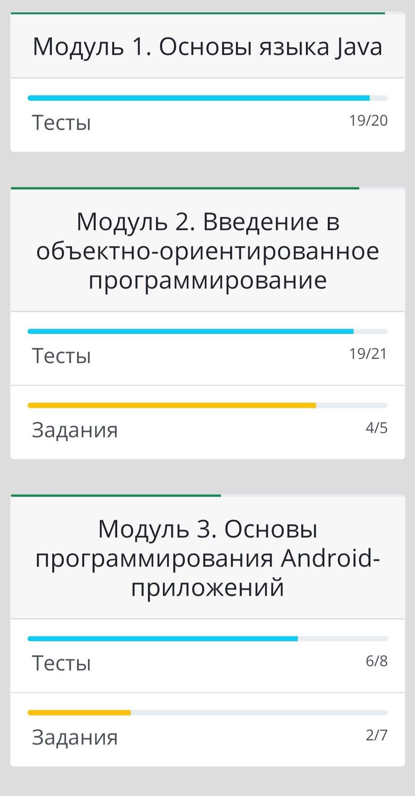
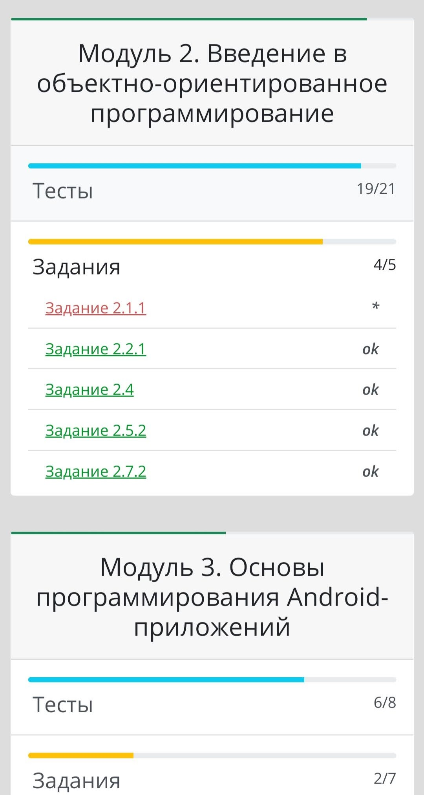
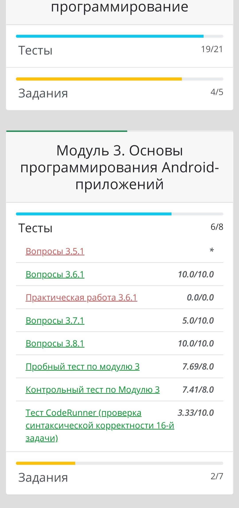

# Samsung progress
Статистика по задачам Samsung IT School  
Скрипт через ваш логин и пароль авторизовывается на сайте [школы](https://myitschool.ru/edu), получает всю информацию о задачах и в виде удобной и красивой html страницы сохраняет на ваше устройство.  

<span>
  
  

</span>
  
## Использование  
1. `pip install -r requirements.txt`  
2. Создать файл `secret.py` вида  
```
USERNAME = "Your username"
PASSWORD = "Your password"
```  
3. Запустить `main.py`  
## 
В консоли будет выводиться некоторая вспомогательная информация о статусе загрузки  
Скрипт работает примерно минуту, для ускорения работы используются библиотеки asyncio и aiohttp
